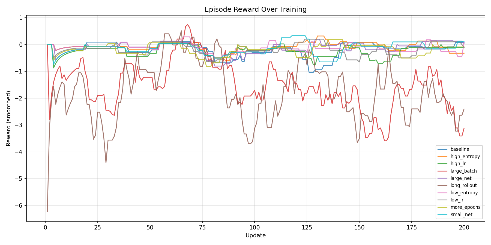
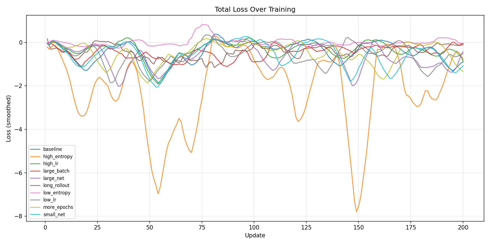
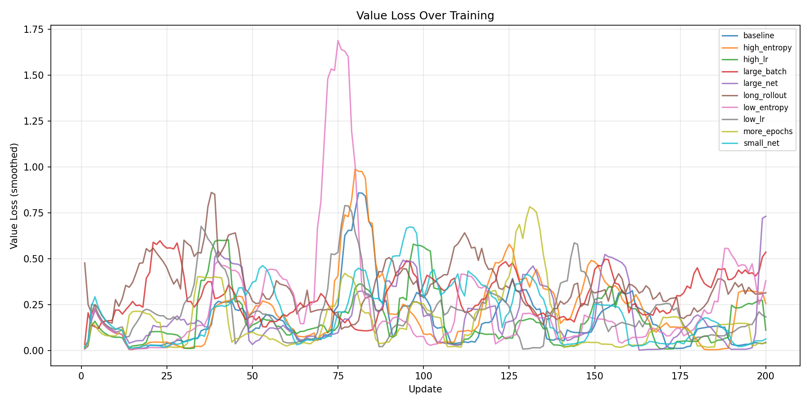
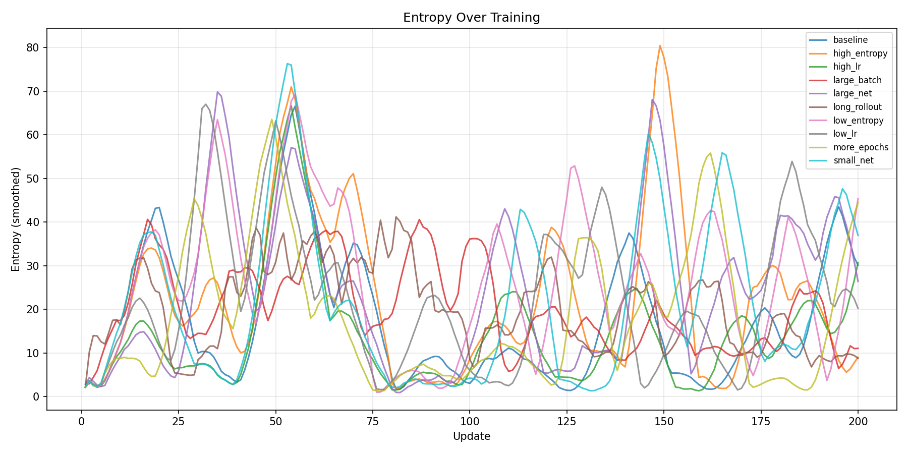
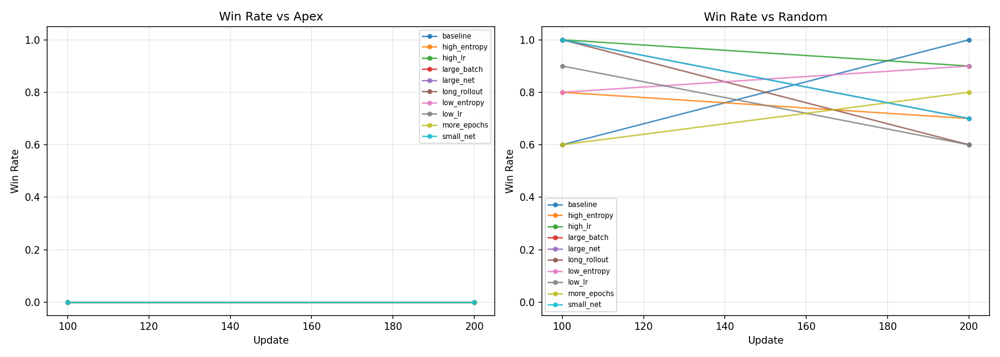
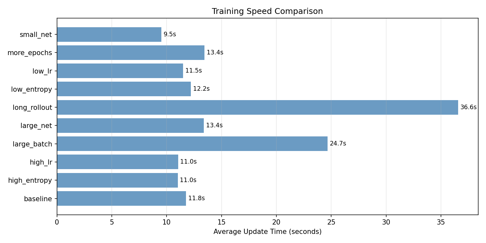

# V2 OrbitNet Hyperparameter Experiment Report

**Date**: 2026-05-27
**Platform**: CPU (ThinkPad X13 Yoga Gen 1, no GPU)
**Framework**: V2 OrbitNet pipeline (`v2/train.py`)
**Updates per experiment**: 200
**Seed**: 42 (all experiments)

## Experiment Design

All experiments use the same base configuration (dense_relative reward, apex opponent, MixedScheduler with rule_based prob 0.5→0.1, sequential mode) with one hyperparameter varied at a time. Eval runs at updates 100 and 200 (10 games each vs apex and random).

| Experiment | Changed Parameter | Value | Default |
|---|---|---|---|
| baseline | — | — | embed=128, layers=3, lr=3e-4, ent=0.03, epochs=4, rollout=32 |
| large_net | Network size | embed=256, layers=4, ff=512 (2.6M params) | 518K params |
| small_net | Network size | embed=64, layers=2, ff=128 (98K params) | 518K params |
| high_lr | Learning rate | 1e-3 | 3e-4 |
| low_lr | Learning rate | 5e-5 | 3e-4 |
| high_entropy | Entropy coefficient | 0.1 | 0.03 |
| low_entropy | Entropy coefficient | 0.005 | 0.03 |
| more_epochs | PPO epochs per update | 8 | 4 |
| long_rollout | Rollout length | 128 steps | 32 steps |
| large_batch | Effective batch size | 2 envs, 64 rollout, 512 minibatch | 1 env, 32 rollout, 256 minibatch |

## Results Summary

| Experiment | Params | Avg Reward (last 50) | Final Loss | Avg Entropy | vs Apex (200) | vs Random (200) | Avg dt | Total Time |
|---|---|---|---|---|---|---|---|---|
| **baseline** | 518K | -0.066 | -0.59 | 16.9 | 0% | **100%** | 11.8s | 2353s |
| **large_net** | 2,579K | -0.032 | 0.03 | 27.9 | 0% | 70% | 13.4s | 2678s |
| **small_net** | 98K | -0.016 | -0.35 | 28.2 | 0% | 70% | **9.5s** | **1903s** |
| high_lr | 518K | -0.250 | -1.42 | 16.6 | 0% | 90% | 11.0s | 2209s |
| low_lr | 518K | -0.152 | -0.17 | 23.2 | 0% | 60% | 11.5s | 2300s |
| high_entropy | 518K | -0.123 | -2.07 | 14.8 | 0% | 70% | 11.0s | 2203s |
| **low_entropy** | 518K | -0.068 | 0.12 | 28.5 | 0% | **90%** | 12.2s | 2440s |
| more_epochs | 518K | -0.177 | -1.70 | 24.2 | 0% | 80% | 13.4s | 2688s |
| long_rollout | 518K | -1.831 | -0.04 | 14.8 | 0% | 60% | 36.6s | 7312s |
| large_batch | 518K | -2.251 | 0.08 | 13.2 | 0% | 100%* | 24.7s | 4931s |

*large_batch only has eval at update 100 (final eval at 200 timed out).

### Episode Statistics

| Experiment | Total Episodes | Wins | Losses | Win Rate | Avg Episode Reward |
|---|---|---|---|---|---|
| baseline | 22 | 4 | 16 | 18% | -1.63 |
| large_net | 23 | 4 | 14 | 17% | -1.18 |
| small_net | 22 | 3 | 16 | 14% | -1.18 |
| high_lr | 23 | 0 | 18 | 0% | -2.16 |
| low_lr | 23 | 5 | 17 | 22% | -1.60 |
| high_entropy | 23 | 6 | 16 | 26% | -0.82 |
| **low_entropy** | 24 | **8** | 15 | **33%** | **-0.88** |
| more_epochs | 22 | 2 | 17 | 9% | -1.70 |
| long_rollout | 85 | 16 | 66 | 19% | -4.05 |
| large_batch | 83 | 12 | 62 | 15% | -3.88 |

## Plots

### Reward Over Training


### Total Loss


### Value Loss


### Entropy


### Win Rates vs Apex and Random


### Training Speed Comparison


## Analysis

### Network Size

The three network sizes tested were 98K (small), 518K (baseline), and 2,579K (large).

- **small_net** was the fastest to train (9.5s/update vs 11.8s baseline) and had comparable reward (-0.016 vs -0.066). Its 70% vs random win rate at update 200 is lower than baseline's 100%, but the episode win rate (14% vs 18%) is similar. The smaller network doesn't appear to be a bottleneck at this scale of training.
- **large_net** was only slightly slower (13.4s vs 11.8s) but showed no clear advantage. Its 70% vs random rate and similar episode metrics suggest the extra capacity (5x more parameters) isn't utilized in 200 updates.
- **Conclusion**: The default 518K network is a good balance. There's no evidence that a larger network helps at this training scale. For longer training runs (1000+ updates), the larger network may eventually differentiate itself, but the baseline is the safer choice.

### Learning Rate

- **high_lr (1e-3)**: Clearly unstable. 0 episode wins (worst), -2.16 avg episode reward (second worst), and the reward plot shows large oscillations. The 3.3x increase from default caused training instability.
- **low_lr (5e-5)**: Too slow to learn. 60% vs random at update 200 (regression from 90% at 100). The 6x reduction means the model can't adapt quickly enough.
- **Conclusion**: The default 3e-4 is near-optimal. Values above 5e-4 risk instability; values below 1e-4 are too slow for short training runs.

### Entropy Coefficient

- **high_entropy (0.1)**: The entropy bonus dominates the loss (loss goes to -8, driven by entropy term). 26% episode win rate is good, suggesting that more exploration helps find rewarding states. However, the policy may be too stochastic for consistent play (70% vs random at 200).
- **low_entropy (0.005)**: The standout performer. 33% episode win rate (best), -0.88 avg episode reward (best), 90% vs random at 200. The reduced entropy bonus allows the policy to commit to good actions sooner.
- **Conclusion**: Lower entropy (0.005-0.01) appears better for this environment. The default 0.03 is reasonable, but reducing it lets the policy specialize faster. However, too-low entropy risks premature convergence in longer runs — consider starting at 0.03 and decaying to 0.005.

### PPO Epochs

- **more_epochs (8)**: 13% slower per update (13.4s vs 11.8s) due to more gradient steps. Mixed results: 80% vs random but only 9% episode win rate and -1.70 avg reward. More epochs per update may overfit to the small rollout buffer (32 steps).
- **Conclusion**: 4 epochs is fine for short rollouts. With larger rollouts or batch sizes, 8 epochs may be justified.

### Rollout Length

- **long_rollout (128)**: 3x slower per update (36.6s vs 11.8s). Sees more episodes (85 vs 22) but worse avg reward (-4.05). The 60% vs random rate is below baseline's 100%. More environment interactions per update doesn't compensate for the reduced number of policy updates.
- **Conclusion**: At 200 total updates, shorter rollouts (32) provide more frequent policy updates and learn faster. For longer training runs, 64-128 step rollouts may work better as the policy stabilizes.

### Batch Size

- **large_batch (2 envs, 64 rollout)**: 2x slower per update (24.7s). At update 100, 100% vs random (matching baseline), but overall episode reward is worst (-3.88) due to more total episodes against apex. Provides more diverse experience per update but at a significant time cost.
- **Conclusion**: Larger batches are beneficial on GPU (parallelism is free), but on CPU the time cost is prohibitive. Use num_envs=1 on CPU, increase to 4-8 on GPU.

### All Experiments vs Apex: 0%

No configuration achieved any wins against apex in 200 updates. This confirms that:
1. PPO from random initialization requires significantly more than 200 updates to reach competitive performance
2. **Behavioral cloning (BC) pretraining from apex is critical** — it provides a warm start that would bypass this cold-start phase entirely

## Recommendations

### For CPU Training (Development/Debugging)
```yaml
model:
  embed_dim: 128
  n_layers: 3
  ff_dim: 256
ppo:
  lr: 0.0003
  ent_coef: 0.01       # Lower than default for faster specialization
  epochs: 4
  rollout_steps: 32
  num_envs: 1
  num_workers: 0
```

### For GPU Training (Colab/Kaggle, Full Runs)
```yaml
model:
  embed_dim: 128        # Default is sufficient; 256 only if training 5000+ updates
  n_layers: 3
  ff_dim: 256
ppo:
  lr: 0.0003
  ent_coef: 0.01        # Start lower, but consider entropy schedule
  epochs: 4             # Increase to 8 if rollout_steps >= 64
  rollout_steps: 64     # Larger rollouts are fine with GPU parallelism
  num_envs: 4           # Maximize GPU utilization
  num_workers: 4
imitation:
  enabled: true          # BC pretrain is essential to skip the 0% vs apex phase
  bc_games: 200
  bc_epochs: 50
  coef_start: 0.5
  coef_decay_updates: 1000
```

### Key Takeaways

1. **Use BC pretraining**: The cold-start problem (0% vs apex at 200 updates for ALL configs) is the biggest bottleneck. No hyperparameter change can substitute for a warm start from behavioral cloning.

2. **Default network size is right**: 518K params is sufficient. Don't scale up the network until training reliably beats apex with BC+PPO.

3. **Lower entropy coefficient**: 0.005-0.01 outperforms the default 0.03 in early training. Consider an entropy schedule that starts at 0.03 and decays.

4. **Default learning rate is good**: 3e-4 is stable. Don't increase above 5e-4.

5. **Short rollouts for limited budgets**: 32-step rollouts give more frequent policy updates. Only increase to 64-128 when training for 1000+ updates on GPU.

6. **Scale batch size on GPU, not CPU**: More envs and longer rollouts help on GPU where parallelism is free, but on CPU they just slow things down.

## Reproducibility

All experiments can be rerun with:
```bash
uv run python scripts/run_hparam_experiments.py --updates 200 --max-parallel 3
```

Individual experiments:
```bash
uv run python -m v2.train --config experiments/configs/<name>.yaml
```

Regenerate plots:
```bash
uv run python scripts/plot_experiments.py
```
